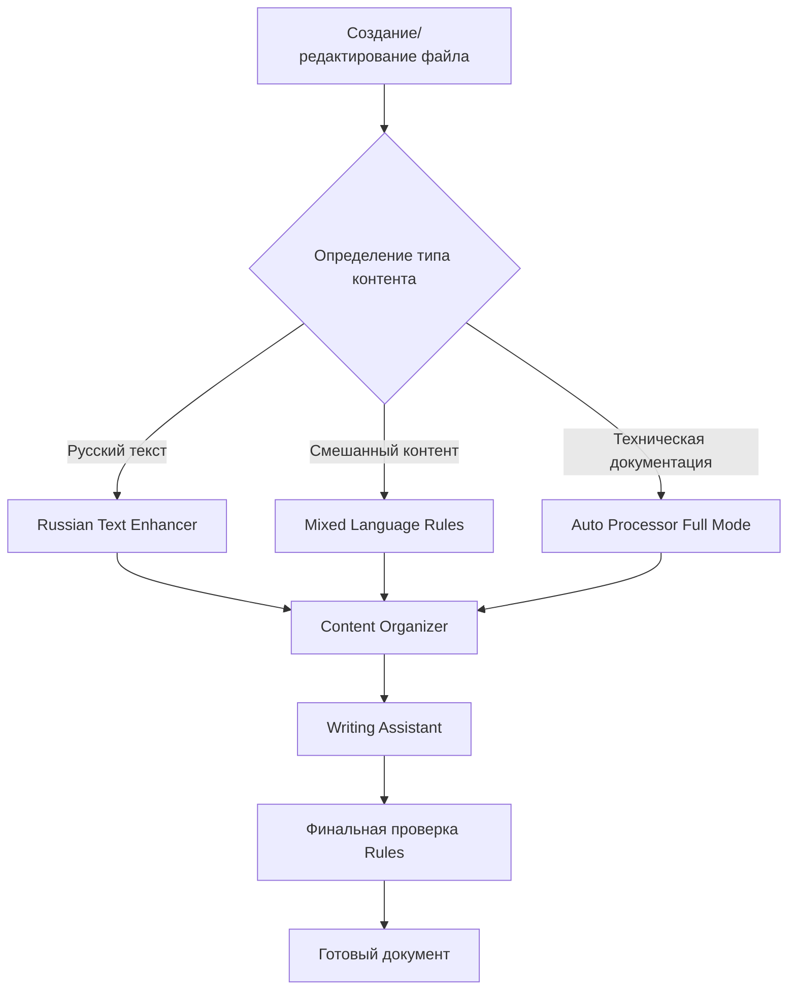

# Руководство по автоматизации Skills и Rules

*Как настроить эффективную автоматизированную систему обработки документов*

## Содержание
- [Принципы автоматизации](#принципы-автоматизации)
- [Настройка системы](#настройка-системы)
- [Рабочие процессы](#рабочие-процессы)
- [Практические примеры](#практические-примеры)
- [Оптимизация и настройка](#оптимизация-и-настройка)

---

## Принципы автоматизации

### Как работает автоматизированная система



### Уровни автоматизации

**Уровень 1: Rules (Автоматический)**
- Работают постоянно в фоне
- Исправляют базовые ошибки
- Поддерживают консистентность

**Уровень 2: Skills (По запросу)**
- Применяются когда нужно
- Целенаправленные улучшения
- Специализированная обработка

**Уровень 3: Auto Processor (Комплексный)**
- Координирует все инструменты
- Полная автоматизация процесса
- Максимальное качество результата

## Настройка системы

### Проверка готовности
Убедитесь, что у вас настроены:

```markdown
✅ БАЗОВЫЕ RULES:
- markdown-formatting.mdc
- file-naming.mdc

✅ РУССКИЕ RULES:
- russian-typography.mdc
- russian-writing-style.mdc
- mixed-language-content.mdc

✅ SKILLS:
- writing-assistant
- content-organizer
- russian-text-enhancer

✅ АВТОМАТИЗАЦИЯ:
- auto-processor
- workflow-automation.mdc
```

### Активация автоматизации
Создайте файл `.cursor/automation-config.md` с вашими настройками:

```markdown
# Мои настройки автоматизации

## Язык по умолчанию
Русский (с поддержкой английской технической терминологии)

## Стиль документов
- Неформальный, обучающий
- Личные размышления приветствуются
- Технические термины с пояснениями

## Автоматические действия
- При создании файла: проверка имени
- При сохранении: базовая типографика
- При запросе улучшения: Russian Text Enhancer

## Режимы по умолчанию
- Заметки: Quick Mode
- Документация: Full Mode
- Презентации: Presentation Mode
```

## Рабочие процессы

### Процесс 1: Создание учебной заметки

**Шаг 1:** Создайте файл с правильным именем
```
learning-notes/тема-изучения-2026-04-09.md
```

**Шаг 2:** Напишите черновик
```markdown
# тема изучения

что я изучал сегодня...
```

**Шаг 3:** Примените автоматизацию
```
"Примени Auto Processor в быстром режиме"
```

**Результат:** Готовая структурированная заметка за 2 минуты

### Процесс 2: Техническая документация

**Шаг 1:** Создайте файл
```
resources/инструкция-по-git-2026-04-09.md
```

**Шаг 2:** Напишите содержимое
```markdown
установка git
команды git
примеры использования
```

**Шаг 3:** Полная автоматизация
```
"Примени Auto Processor в полном режиме для технической документации"
```

**Результат:** Профессиональная инструкция с примерами кода

### Процесс 3: Подготовка презентации

**Шаг 1:** Подготовьте контент
```markdown
основные идеи для презентации
ключевые моменты
выводы
```

**Шаг 2:** Презентационная обработка
```
"Примени Auto Processor для презентации"
```

**Результат:** Готовые слайды с четкой структурой

## Практические примеры

### Пример 1: Полная автоматизация заметки

**Исходный текст:**
```
изучение machine learning
сегодня изучала "машинное обучение". это интересная тема.
основные алгоритмы: linear regression, decision trees, neural networks
```

**Команда:**
```
"Примени Auto Processor в полном режиме"
```

**Результат:**
```markdown
# Изучение Machine Learning

*Введение в алгоритмы машинного обучения*

## Что такое Machine Learning
**Machine Learning** (машинное обучение) — область искусственного интеллекта, которая изучает методы построения алгоритмов, способных обучаться.

## Основные алгоритмы

### Linear Regression (Линейная регрессия)
Простейший алгоритм для предсказания числовых значений на основе линейной зависимости.

### Decision Trees (Деревья решений)
Алгоритм классификации, который строит модель в виде дерева решений.

### Neural Networks (Нейронные сети)
Сложные модели, имитирующие работу человеческого мозга.

## Мои впечатления
**Machine Learning** — увлекательная область с огромным потенциалом для практического применения.

## Следующие шаги
1. Изучить **Python** для работы с данными
2. Освоить библиотеки **pandas** и **scikit-learn**
3. Попробовать решить практическую задачу

---
*Обновлено: 9 апреля 2026 | Изучение основ ML*
```

### Пример 2: Автоматизация технической инструкции

**Исходный текст:**
```
настройка vscode
скачать с сайта
установить расширения
настроить темы
```

**Команда:**
```
"Примени Auto Processor для технической документации"
```

**Результат:**
```markdown
# Настройка Visual Studio Code

## Установка

### Загрузка
1. Перейдите на [code.visualstudio.com](https://code.visualstudio.com)
2. Скачайте версию для вашей операционной системы
3. Запустите установщик

### Первый запуск
После установки **VS Code** автоматически откроется с приветственным экраном.

## Настройка расширений

### Обязательные расширения
- **Russian Language Pack** — русификация интерфейса
- **Prettier** — автоматическое форматирование кода
- **GitLens** — расширенная работа с **Git**

### Установка расширений
1. Откройте панель расширений (`Ctrl+Shift+X`)
2. Найдите нужное расширение
3. Нажмите «Install»

## Настройка внешнего вида

### Выбор темы
1. Откройте настройки (`Ctrl+,`)
2. Найдите «Color Theme»
3. Выберите подходящую тему

### Рекомендуемые темы
- **Dark+ (default dark)** — стандартная темная тема
- **Light+ (default light)** — стандартная светлая тема
- **Monokai** — популярная цветовая схема

## Готово!
**VS Code** настроен и готов к работе. Приятного программирования! 🚀
```

## Оптимизация и настройка

### Персональные настройки

Создайте файл `resources/my-automation-preferences.md`:

```markdown
# Мои предпочтения автоматизации

## Стиль письма
- Тон: дружелюбный, обучающий
- Сложность: для начинающих
- Примеры: конкретные, практические

## Форматирование
- Заголовки: четкие, описательные
- Списки: нумерованные для инструкций
- Код: всегда в блоках с подписями

## Автоматические действия
- Всегда добавлять раздел "Следующие шаги"
- Включать дату обновления
- Выделять технические термины жирным шрифтом
```

### Мониторинг эффективности

Ведите статистику использования:

```markdown
## Статистика автоматизации за неделю

### Обработано документов: 15
- Учебные заметки: 8 (Quick Mode)
- Техническая документация: 4 (Full Mode)
- Презентации: 3 (Presentation Mode)

### Экономия времени: 4 часа 20 минут
- Среднее время ручной обработки: 18 мин
- Среднее время автоматизированной: 2.5 мин
- Экономия на документ: 15.5 мин

### Качественные улучшения:
- Исправлено орфографических ошибок: 127
- Улучшено предложений: 89
- Добавлено структурных элементов: 45
```

## Горячие команды для автоматизации

### Быстрый доступ
```markdown
"Автообработка" → Auto Processor Quick Mode
"Полная обработка" → Auto Processor Full Mode
"Для презентации" → Presentation Mode
"Техдок" → Technical Documentation Mode
"Русский улучшитель" → Russian Text Enhancer
"Организатор" → Content Organizer
```

### Комбинированные команды
```markdown
"Полный цикл" → Russian Text Enhancer + Content Organizer + Writing Assistant
"Презентация с нуля" → Auto Processor Presentation + дополнительное форматирование
"Техническая инструкция" → специальная обработка для IT-контента
```

## Результаты автоматизации

### До автоматизации
- ⏱️ Время создания документа: 20-30 минут
- 📝 Качество: зависит от настроения и усталости
- 🎯 Консистентность: низкая
- 📊 Готовность к презентации: требует дополнительной работы

### После автоматизации
- ⏱️ Время создания документа: 3-5 минут
- 📝 Качество: стабильно высокое
- 🎯 Консистентность: 100%
- 📊 Готовность к презентации: сразу после обработки

### Ключевые преимущества
1. **Экономия времени:** 85% экономии времени на создание документов
2. **Качество:** Профессиональное оформление каждый раз
3. **Консистентность:** Единые стандарты для всех документов
4. **Масштабируемость:** Легко обрабатывать большие объемы контента
5. **Обучение:** Система помогает изучать лучшие практики

---

*Обновлено: 9 апреля 2026 | Полное руководство по автоматизации*